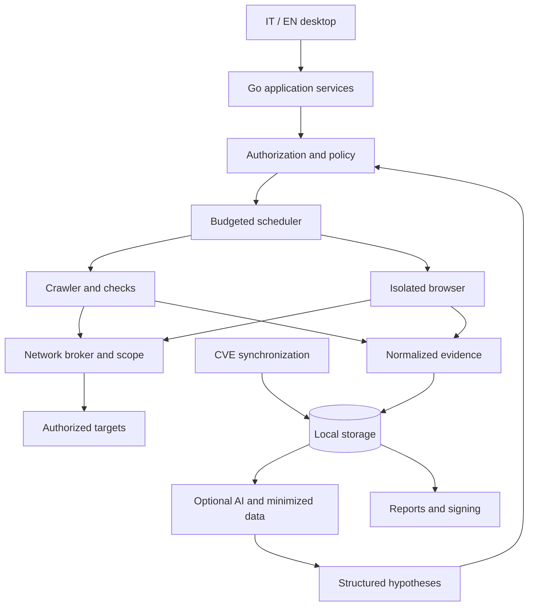

# Desktop architecture

[Italiano](../it/ARCHITECTURE.md) · [Index](../README.md)

Status: planned product architecture. The Qt Widgets/MIQT desktop, limited [M1](M1-VALIDATION.md) HTTP workflow and [M2](M2-VALIDATION.md) intelligence/report workflow are implemented; the complete diagrammed cycle remains unfinished. The first M3 blocks add [policy](M3-BROWSER-GATE.md) and an [HTTP proxy](M3-BROWSER-PROXY.md), still without a browser runtime.

## Initial structure

Native desktop application, one operator and local data. A modular Go monolith contains the domain and coordination; the GUI toolkit must not enter analysis packages. The interface calls application services through internal Go APIs. No control HTTP server is exposed by default. A future CLI will reuse the same services.

The broker represents a boundary to implement and test for browser traffic, redirects, WebSockets and workers too. A diagram does not establish isolation. Browser scanning will not ship until browser containment passes its tests.

## Modules and responsibilities

| Module | Contract |
| --- | --- |
| `project` / `policy` | Project, versioned scope, authorizations, exclusions and immutable per-run budgets |
| `scheduler` | Persistent local queue, bounded workers, cancellation, checkpoints and state |
| `transport` | Exclusive target access; validates destinations, timeouts, sizes and rate limits |
| `discovery` / `checks` | Inventory and versioned checks, with no direct network or secret access |
| `evidence` | Redaction, immutable references, quota and retention |
| `intelligence` | CVE cache, mapping and provenance, separate from target traffic |
| `ai` | Adapters with schemas, budgets and separate egress policies |
| `retest` | Baselines, comparability, observations and regressions |
| `report` | Snapshots, rendering, manifests and signing through a component with limited key access |
| `storage` | Transactions, migrations, deletion and recovery |

The table describes planned complete contracts. In the [M1 alpha](M1-VALIDATION.md), `internal/project` binds authorization and origins, `internal/scope` and `internal/transport` enforce policy, budgets and pinned IPs, `internal/scanner` provides controlled visits, discovery and one header check, `internal/storage` retains projects and redacted observations, and `internal/desktop` exposes the IT/EN workflow. [M2](M2-VALIDATION.md) adds CVE caching, correlations and verifiable reports. `internal/browser` now contains a gate and local HTTP proxy; a working browser and AI engines remain future work. Avoid dynamic Go plugins in the first version: checks are compiled and reviewed. Future third-party plugins require an isolated process and versioned protocol.

## Persistence and external processes

SQLite is selected (ADR-004) for projects and redacted observations; separate files may hold large future evidence. The M1 store implements schema **v4**, with migrations from v1/v2/v3, authorization revisions, persistent revocation, a run/visit ledger, a 64 MiB main-file limit, private backup and cascading logical deletion ([details](M1-PROJECT-STORE.md)). Open runs become `interrupted` on restart without resuming requests. A resumable queue, raw evidence and forensic recovery are not implemented; a future checkpoint and queue state must be transactionally consistent.

Keep credentials and private keys in the system keychain or an encrypted container unlocked by the operator. The database stores references, not plaintext secrets. SQLite encryption is not automatic: choose a compatible library explicitly and document metadata exposure.

Browsers and LLM runtimes receive temporary directories and minimal credentials. Use pipes or permission-protected local sockets for IPC; if a runtime uses local HTTP, bind to loopback with authentication and origin controls. The browser must not inherit the personal browser profile. Closing the app stops workers; restarting does not automatically repeat operations with uncertain effects.

## States and failures

Run: `draft → queued → running → completed | partial | failed | cancelled`. Restart changes an orphaned `running` run to `interrupted`; resuming creates a tracked attempt after authorization is rechecked. `completed` means planned operations finished, not universal coverage or absence of issues.

All long operations propagate cancellation. The GUI thread stays responsive; events are aggregated to avoid flooding it. Stable localizable errors have a `code`, message and redacted details. Retry only repeatable operations, with limits and backoff; target and provider rate limits are independent.

## Future growth

Server mode, shared users, PostgreSQL and distributed workers require dedicated ADRs and authorization boundaries. Do not deploy distributed infrastructure for one desktop application. A company license does not automatically imply multi-user functionality.

## Implemented scope foundation

`internal/scope` implements only immutable HTTP(S) origin comparison, with no networking or Qt dependencies. A loopback laboratory exists exclusively in tests. It does not replace the planned broker’s IP/DNS, authorization and budget boundaries: [M0 contract](M0-SCOPE.md).

`internal/transport` adds an HTTP/TLS broker with loopback or pinned public IP grants, peer verification and shared budgets/cancellation. Decisions and limits: [ADR-003](ADR-003-TRANSPORT.md) and [ADR-008](ADR-008-PINNED-PUBLIC-TRANSPORT.md). The M1 GUI uses it for controlled visits.

`NewAuthorizedLab` applies the project snapshot on every hop of the same broker and uses its expiry to stop in-progress requests. [Managed runs](M1-MANAGED-RUNS.md) add local store-bound revocation; it remains a lab: [M1 contract](M1-AUTHORIZED-LAB.md).

SQLite and the JWS profile are selected in [ADR-004](ADR-004-STORAGE-SIGNATURE.md): the [M1 store](M1-PROJECT-STORE.md), `internal/signature` and the [M2 report workflow](M2-VALIDATION.md) exist in the GUI.
