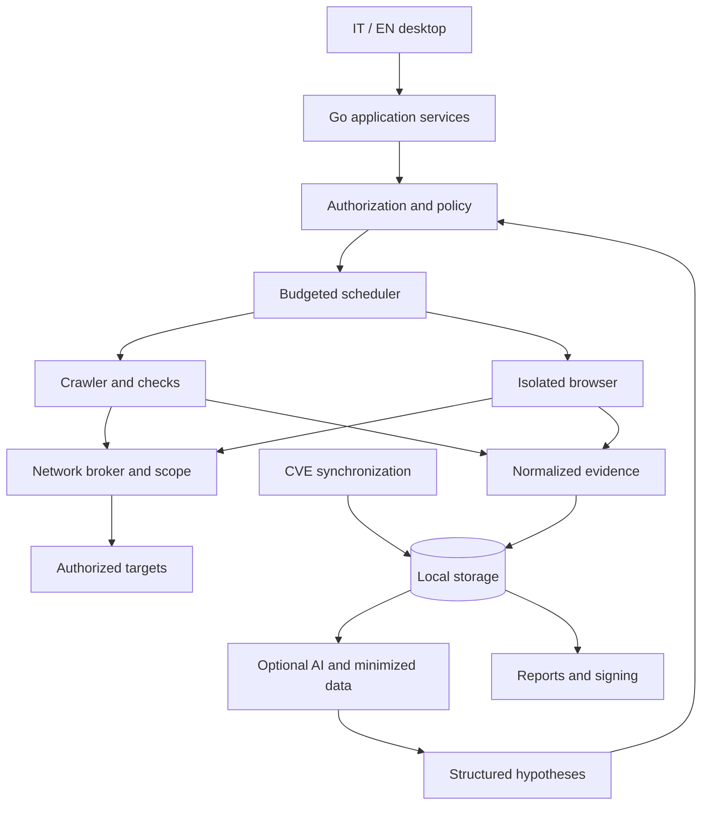

# Desktop architecture

[Italiano](../it/ARCHITECTURE.md) · [Index](../README.md)

Status: planned product architecture. Only the desktop entry point, Fyne workspace, IT/EN catalogs and offline fixtures described in [M0](M0-DESKTOP.md) are implemented; the scanning diagram components remain unimplemented.

## Initial structure

Native desktop application, one operator and local data. A modular Go monolith contains the domain and coordination; the GUI toolkit must not enter analysis packages. The interface calls application services through internal Go APIs. No control HTTP server is exposed by default. A future CLI will reuse the same services.

The broker represents a boundary to implement and test for browser traffic, redirects, WebSockets and workers too. A diagram does not establish isolation. Browser scanning will not ship until browser containment passes its tests.

## Modules and responsibilities

| Module | Contract |
| --- | --- |
| `project` / `policy` | Project, versioned scope, authorizations, exclusions and immutable per-run budgets |
| `scheduler` | Persistent local queue, bounded workers, cancellation, checkpoints and state |
| `transport` | Exclusive target access; validates destinations, timeouts, sizes and rate limits |
| `discovery` / `checks` | Inventory and versioned checks, with no direct network or secret access |
| `evidence` | Redaction, immutable references, quota and retention |
| `intelligence` | CVE cache, mapping and provenance, separate from target traffic |
| `ai` | Adapters with schemas, budgets and separate egress policies |
| `retest` | Baselines, comparability, observations and regressions |
| `report` | Snapshots, rendering, manifests and signing through a component with limited key access |
| `storage` | Transactions, migrations, deletion and recovery |

Names are proposed boundaries, not existing directories. Avoid dynamic Go plugins in the first version: checks are compiled and reviewed. Future third-party plugins require an isolated process and versioned protocol.

## Persistence and external processes

SQLite is proposed for metadata, the queue and observations; separate files hold larger evidence. Serialize writes where useful, enforce foreign keys, migrations and disk quotas. Save a checkpoint and queue state in one transaction when they describe the same progress. Write files to staging first, then promote them atomically; recovery removes orphans without deleting referenced evidence.

Keep credentials and private keys in the system keychain or an encrypted container unlocked by the operator. The database stores references, not plaintext secrets. SQLite encryption is not automatic: choose a compatible library explicitly and document metadata exposure.

Browsers and LLM runtimes receive temporary directories and minimal credentials. Use pipes or permission-protected local sockets for IPC; if a runtime uses local HTTP, bind to loopback with authentication and origin controls. The browser must not inherit the personal browser profile. Closing the app stops workers; restarting does not automatically repeat operations with uncertain effects.

## States and failures

Run: `draft → queued → running → completed | partial | failed | cancelled`. Restart changes an orphaned `running` run to `interrupted`; resuming creates a tracked attempt after authorization is rechecked. `completed` means planned operations finished, not universal coverage or absence of issues.

All long operations propagate cancellation. The GUI thread stays responsive; events are aggregated to avoid flooding it. Stable localizable errors have a `code`, message and redacted details. Retry only repeatable operations, with limits and backoff; target and provider rate limits are independent.

## Future growth

Server mode, shared users, PostgreSQL and distributed workers require dedicated ADRs and authorization boundaries. Do not deploy distributed infrastructure for one desktop application. A company license does not automatically imply multi-user functionality.
