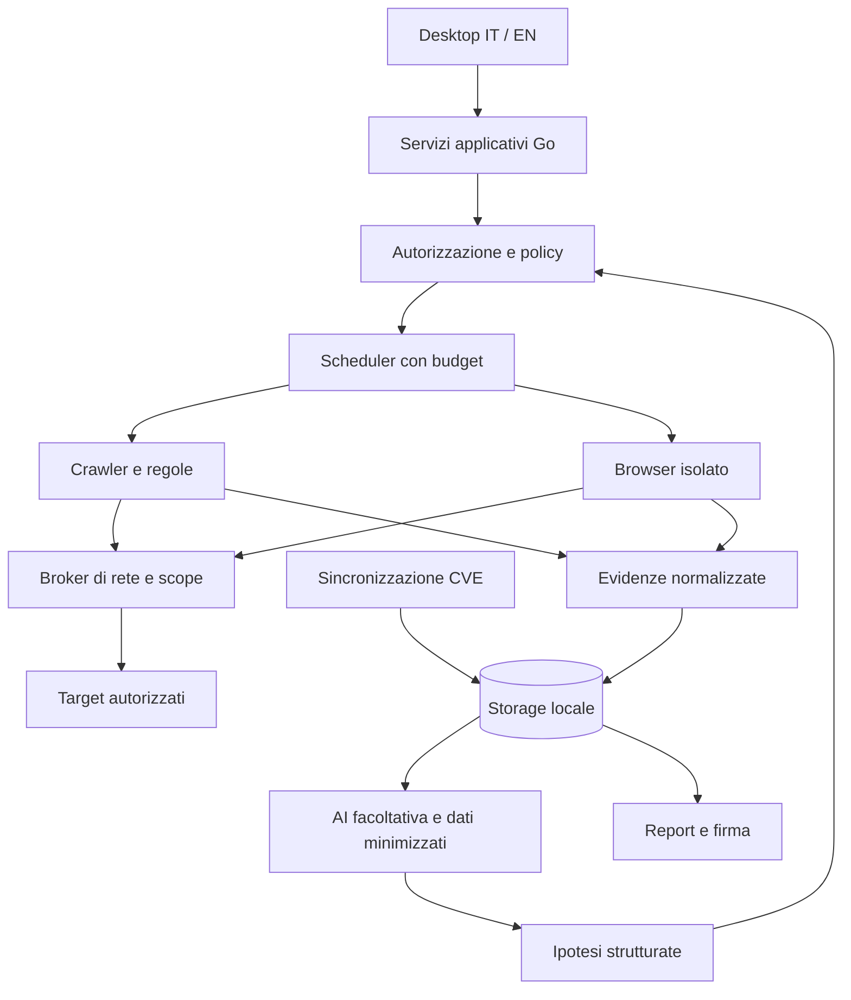

# Architettura desktop

[English](../en/ARCHITECTURE.md) · [Indice](../README.md)

Stato: architettura del prodotto pianificata. Sono implementati il desktop Qt Widgets/MIQT, il flusso HTTP limitato [M1](M1-VALIDATION.md) e il flusso intelligence/report [M2](M2-VALIDATION.md); il ciclo completo del diagramma resta da realizzare. I primi blocchi M3 aggiungono [policy](M3-BROWSER-GATE.md), [proxy HTTP](M3-BROWSER-PROXY.md) e un [laboratorio Qt WebEngine](M3-BROWSER-LAB.md), ancora senza runtime browser nel desktop.

## Struttura iniziale

Applicazione desktop nativa, un operatore e dati locali. Un monolite modulare Go contiene dominio e coordinamento; il toolkit GUI non deve entrare nei pacchetti di analisi. L'interfaccia chiama servizi applicativi tramite API Go interne. Nessun server HTTP di controllo esposto di default. Un'eventuale CLI riutilizzerà gli stessi servizi.

Il broker rappresenta un confine da implementare e provare anche per traffico browser, redirect, WebSocket e worker. Disegnarlo non garantisce l'isolamento. Finché il browser non supera i test di contenimento, la scansione browser non viene rilasciata.

## Moduli e responsabilità

| Modulo | Contratto |
| --- | --- |
| `project` / `policy` | Progetto, scope versionato, autorizzazioni, esclusioni e budget immutabili per ogni run |
| `scheduler` | Coda locale persistente, worker limitati, cancellazione, checkpoint e stato |
| `transport` | Unico accesso al target; valida destinazione, timeout, dimensioni e rate limit |
| `discovery` / `checks` | Inventario e controlli versionati, senza accesso diretto a rete o segreti |
| `evidence` | Redazione, riferimenti immutabili, quota e conservazione |
| `intelligence` | Cache CVE, mapping e provenienza, separata dal traffico verso il target |
| `ai` | Adattatori con schema, budget e policy di uscita separati |
| `retest` | Baseline, comparabilità, osservazioni e regressioni |
| `report` | Snapshot, rendering, manifest e firma tramite componente con accesso limitato alle chiavi |
| `storage` | Transazioni, migrazioni, cancellazione e ripristino |

La tabella descrive i contratti completi pianificati. Nell'[alpha M1](M1-VALIDATION.md), `internal/project` lega autorizzazione e origini, `internal/scope` e `internal/transport` impongono policy, budget e IP fissati, `internal/scanner` realizza visite controllate, discovery e un controllo di header, `internal/storage` conserva progetti e osservazioni redatte e `internal/desktop` espone il flusso IT/EN. [M2](M2-VALIDATION.md) aggiunge cache CVE, correlazioni e report verificabili. `internal/browser` contiene gate e proxy HTTP locale; browser operativo e motori AI restano futuri. Evitare plugin Go dinamici nella prima versione: i controlli sono compilati e revisionati. Eventuali plugin di terzi richiederanno un processo isolato e un protocollo versionato.

## Persistenza e processi esterni

SQLite è scelto (ADR-004) per progetti e osservazioni redatte; file separati per eventuali prove voluminose future. Lo store M1 implementa lo schema **v4**, con migrazioni v1/v2/v3, revisioni di autorizzazione, revoca persistente, ledger di run/visite, limite di 64 MiB sul file principale, backup privato e cancellazione logica a cascata ([dettagli](M1-PROJECT-STORE.md)). Le run aperte al riavvio diventano `interrupted`, senza riprendere richieste. La coda riprendibile, prove grezze e recupero forense non sono implementati; un futuro checkpoint e stato coda dovranno essere coerenti nella stessa transazione.

Credenziali e chiavi private nel portachiavi del sistema o in un contenitore cifrato sbloccato dall'operatore. Il database contiene riferimenti, non segreti in chiaro. La cifratura di SQLite non è automatica: scegliere esplicitamente una libreria compatibile e documentare cosa rimane nei metadati.

Browser e runtime LLM hanno directory temporanee e credenziali minime. IPC su pipe o socket locale con permessi; se un runtime usa HTTP locale, vincolarlo al loopback con autenticazione e controllo delle origini. Il processo browser non deve ereditare il profilo personale. La chiusura dell'app interrompe i worker; una ripartenza non ripete automaticamente operazioni con effetti incerti.

## Stati e fallimenti

Run: `draft → queued → running → completed | partial | failed | cancelled`. Il riavvio trasforma un `running` orfano in `interrupted`; riprendere crea un tentativo tracciato dopo nuova verifica dell'autorizzazione. `completed` indica fine delle operazioni pianificate, non copertura universale o assenza di problemi.

Tutte le operazioni lunghe propagano un contesto di cancellazione. Il thread GUI resta reattivo; gli eventi vengono aggregati in modo da non saturarlo. Errori stabili e localizzabili hanno `code`, messaggio e dettagli redatti. Retry soltanto per operazioni compatibili con ripetizione, limitati e con backoff; rate limit del target e del provider sono indipendenti.

## Crescita futura

La modalità server, utenti condivisi, PostgreSQL e worker distribuiti richiedono ADR e confini di autorizzazione dedicati. Non installare infrastruttura distribuita per una singola applicazione desktop. Una licenza aziendale non implica automaticamente una modalità multiutente.

## Fondazione scope implementata

`internal/scope` realizza soltanto il confronto immutabile di origini HTTP(S), senza rete e senza dipendenze Qt. Un laboratorio loopback esiste esclusivamente nei test. Non sostituisce i confini IP/DNS, autorizzazioni e budget del broker pianificato: [contratto M0](M0-SCOPE.md).

`internal/transport` aggiunge un broker HTTP/TLS con grant loopback o IP pubblici fissati, con verifica del peer e budget/cancellazione condivisi. Decisioni e limiti: [ADR-003](ADR-003-TRANSPORT.md) e [ADR-008](ADR-008-PINNED-PUBLIC-TRANSPORT.md). La GUI M1 lo usa per le visite controllate.

`NewAuthorizedLab` applica lo snapshot del progetto a ogni hop del medesimo broker e ne usa la scadenza per interrompere richieste in corso. Le [run gestite](M1-MANAGED-RUNS.md) aggiungono revoca locale collegata allo store; rimane un laboratorio: [contratto M1](M1-AUTHORIZED-LAB.md).

SQLite e il profilo JWS sono selezionati in [ADR-004](ADR-004-STORAGE-SIGNATURE.md): esistono lo [store M1](M1-PROJECT-STORE.md), `internal/signature` e il [flusso report M2](M2-VALIDATION.md) nella GUI.
