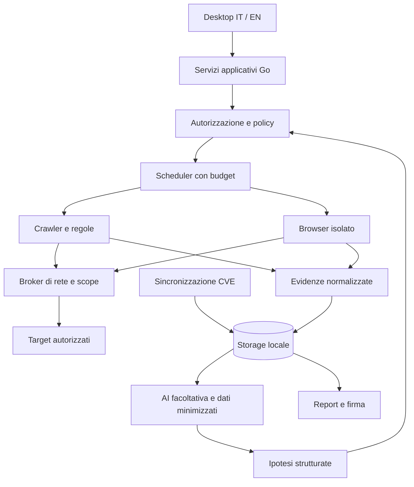

# Architettura desktop

[English](../en/ARCHITECTURE.md) · [Indice](../README.md)

Stato: architettura del prodotto pianificata. Per il desktop sono implementati il punto di ingresso desktop, il workspace Qt Widgets/MIQT, i cataloghi IT/EN e le fixture offline descritte in [Qt M0](QT-DESKTOP.md); il ciclo completo del diagramma di scansione resta da realizzare; le fondazioni scope/trasporto M0 sono descritte sotto.

## Struttura iniziale

Applicazione desktop nativa, un operatore e dati locali. Un monolite modulare Go contiene dominio e coordinamento; il toolkit GUI non deve entrare nei pacchetti di analisi. L'interfaccia chiama servizi applicativi tramite API Go interne. Nessun server HTTP di controllo esposto di default. Un'eventuale CLI riutilizzerà gli stessi servizi.

Il broker rappresenta un confine da implementare e provare anche per traffico browser, redirect, WebSocket e worker. Disegnarlo non garantisce l'isolamento. Finché il browser non supera i test di contenimento, la scansione browser non viene rilasciata.

## Moduli e responsabilità

| Modulo | Contratto |
| --- | --- |
| `project` / `policy` | Progetto, scope versionato, autorizzazioni, esclusioni e budget immutabili per ogni run |
| `scheduler` | Coda locale persistente, worker limitati, cancellazione, checkpoint e stato |
| `transport` | Unico accesso al target; valida destinazione, timeout, dimensioni e rate limit |
| `discovery` / `checks` | Inventario e controlli versionati, senza accesso diretto a rete o segreti |
| `evidence` | Redazione, riferimenti immutabili, quota e conservazione |
| `intelligence` | Cache CVE, mapping e provenienza, separata dal traffico verso il target |
| `ai` | Adattatori con schema, budget e policy di uscita separati |
| `retest` | Baseline, comparabilità, osservazioni e regressioni |
| `report` | Snapshot, rendering, manifest e firma tramite componente con accesso limitato alle chiavi |
| `storage` | Transazioni, migrazioni, cancellazione e ripristino |

La tabella descrive i contratti completi pianificati. `internal/scope` e `internal/transport` implementano soltanto le fondazioni M0 descritte sotto; gli altri moduli del motore non sono ancora presenti. Evitare plugin Go dinamici nella prima versione: i controlli sono compilati e revisionati. Eventuali plugin di terzi richiederanno un processo isolato e un protocollo versionato.

## Persistenza e processi esterni

SQLite è scelto (ADR-004) per il futuro store di metadati, coda e osservazioni; file separati per prove voluminose. Accesso serializzato alle scritture quando utile, foreign key, migrazioni e quota disco. Un checkpoint e lo stato della coda devono essere salvati nella stessa transazione quando descrivono lo stesso avanzamento. I file si scrivono prima in area temporanea, poi si promuovono atomicamente; un recupero elimina orfani senza cancellare prove referenziate.

Credenziali e chiavi private nel portachiavi del sistema o in un contenitore cifrato sbloccato dall'operatore. Il database contiene riferimenti, non segreti in chiaro. La cifratura di SQLite non è automatica: scegliere esplicitamente una libreria compatibile e documentare cosa rimane nei metadati.

Browser e runtime LLM hanno directory temporanee e credenziali minime. IPC su pipe o socket locale con permessi; se un runtime usa HTTP locale, vincolarlo al loopback con autenticazione e controllo delle origini. Il processo browser non deve ereditare il profilo personale. La chiusura dell'app interrompe i worker; una ripartenza non ripete automaticamente operazioni con effetti incerti.

## Stati e fallimenti

Run: `draft → queued → running → completed | partial | failed | cancelled`. Il riavvio trasforma un `running` orfano in `interrupted`; riprendere crea un tentativo tracciato dopo nuova verifica dell'autorizzazione. `completed` indica fine delle operazioni pianificate, non copertura universale o assenza di problemi.

Tutte le operazioni lunghe propagano un contesto di cancellazione. Il thread GUI resta reattivo; gli eventi vengono aggregati in modo da non saturarlo. Errori stabili e localizzabili hanno `code`, messaggio e dettagli redatti. Retry soltanto per operazioni compatibili con ripetizione, limitati e con backoff; rate limit del target e del provider sono indipendenti.

## Crescita futura

La modalità server, utenti condivisi, PostgreSQL e worker distribuiti richiedono ADR e confini di autorizzazione dedicati. Non installare infrastruttura distribuita per una singola applicazione desktop. Una licenza aziendale non implica automaticamente una modalità multiutente.

## Fondazione scope implementata

`internal/scope` realizza soltanto il confronto immutabile di origini HTTP(S), senza rete e senza dipendenze Qt. Un laboratorio loopback esiste esclusivamente nei test. Non sostituisce i confini IP/DNS, autorizzazioni e budget del broker pianificato: [contratto M0](M0-SCOPE.md).

`internal/transport` aggiunge un broker HTTP/TLS confinato a grant loopback, con IP fissato alla connessione e budget/cancellazione condivisi. Decisione M0 e limiti di produzione: [ADR-003](ADR-003-TRANSPORT.md). Nessuna chiamata dalla GUI.

SQLite e il profilo JWS sono selezionati in [ADR-004](ADR-004-STORAGE-SIGNATURE.md): test di fattibilità SQLite e componente `internal/signature`, senza store progetti né report nella GUI.
